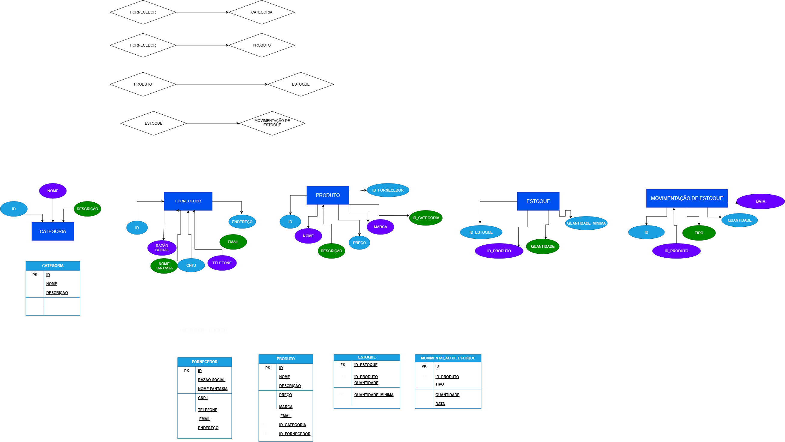

# Prova-BCD

# Desafio 2: Estoque da Loja

# Mer e Der:

## Dicionário de Dados

| Entidade | Atributo | Tipo | Tamanho| Descrição |
|-|-|-|-|-|
|Produto | id | Int | 11 | Identificador, PK, Auto incrementável |
|Produto| nome | varchar | 100 | Nome do produto|
|Produto |Descrição| varchar | 100| Informações sobre o produto|
|Produto | Preço | Decimal | 10,2 | Valor do produto|
|Produto | Marca| varchar | 20 | Criadora do produto |
|Produto | id_categoria | int | 30 | Identificador de categoria |
|Produto | id_fornecedor | int | 30 | identificador do fornecedor |
| Categoria | id | Inteiro | 11 | Identificador, PK, Auto incrementável |
| Categoria| nome | varchar | 100 | Nome da categoria|
| Categoria | descrição | varchar | 100 | Descrição da categoria |
|Fornecedor| id | int | 11 | identificador do fornecedor|
|Fornecedor| Razão_soical| varchar | 50 | Nome oficial jurídico de uma empresa |
|Fornecedor | Nome_fantasia | varchar | 50 | Nome comercial da empresa |
|Fornecedor | CNPJ | varchar | 20 | Cadastro Nacional da Pessoa Jurídica |
|Fornecedor| Telefone | varchar | 20 | Telefone da empresa|
|Fornecedor| email | varchar | 100 | Email da empresa|
|Fornecedor| endereço | varchar| 150 | endereço da empresa |
|Estoque | id_estoque| int| 11 | identificação de estoque |
|Estoque| id_produto| int| 50 |identificação do produto|
|Estoque| quantidade | int| 100 | Quantidade do estoque|
|Estoque| quantidade_minima|int| 20 | quantidade minima de produto|
|movimentaçaõ_de_estoque| id | int| 11 | Identificação da movimentação de estoque |
|movimentaçaõ_de_estoque | Id_produto| int| 50| Identificação do produto |
|movimentaçaõ_de_estoque| tipo| enum|  |Identificação do produto|
|movimentaçaõ_de_estoque| quantidade | int| | Quantidade do produtos que restam no estoque|
|movimentaçaõ_de_estoque| data|date| 20 | Data da entrada e saida de produtos|

## Dados em CSV:

-
